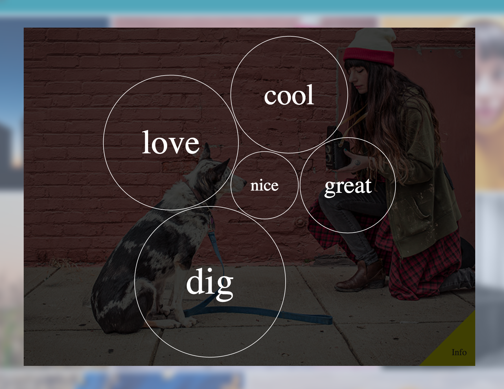

# React Bubble Chart

A combination React/D3 bubble chart that animates color/size/position when
updating data sets.


Here's a [blog post](http://www.jkaufman.io/react-d3-love/) I wrote on this.

For a live demo, head on over to
[Election Insights](http://electioninsights.mybluemix.net/). The code for that
is [here](https://github.com/IBM-Bluemix/election-insights), and my blog post
about it is [here](http://www.jkaufman.io/election-insights/).

## Installation

```sh
npm install react-bubble-chart
```

## Use

NOTE: you must include the css rules provided in `src/styles.css` (also
included is a LESS file if that's your cup of tea) somewhere on your page for
this component to work properly.

ANOTHER NOTE: this component does not load in React directly (as to not
conflict with whatever version of React you're already using). As a result of
this, it will not work if you don't already have react installed in your
project.

```js
import React            from 'react';
import ReactBubbleChart from 'react-bubble-chart';
import Actions          from '../Actions';

var colorLegend = [
  //reds from dark to light
  {color: "#67000d", text: 'Negative', textColor: "#ffffff"}, "#a50f15", "#cb181d", "#ef3b2c", "#fb6a4a", "#fc9272", "#fcbba1", "#fee0d2",
  //neutral grey
  {color: "#f0f0f0", text: 'Neutral'},
  // blues from light to dark
  "#deebf7", "#c6dbef", "#9ecae1", "#6baed6", "#4292c6", "#2171b5", "#08519c", {color: "#08306b", text: 'Positive', textColor: "#ffffff"}
];

var tooltipProps = [{
  css: 'symbol',
  prop: '_id'
}, {
  css: 'value',
  prop: 'value',
  display: 'Last Value'
}, {
  css: 'change',
  prop: 'colorValue',
  display: 'Change'
}];

class BubbleChart extends React.Component {
  render () {
    var data = this.props.data.map(d => ({
      _id: d._id,
      value: d.value,
      colorValue: d.sentiment,
      selected: d.selected
    }));

    return <ReactBubbleChart
      className="my-cool-chart"
      colorLegend={colorLegend}
      data={data}
      selectedColor="#737373"
      selectedTextColor="#d9d9d9"
      fixedDomain={{min: -1, max: 1}}
      onClick={Actions.doStuff.bind(Actions)}
      legend={true}
      legendSpacing={0}
      tooltip={true}
      tooltipProps={tooltipProps}
      tooltipFunc={tooltipFunc}
    />;
  }
}

module.exports = BubbleChart;
```

To update the data, simply update the parent component that passes down the
`data` prop to the bubble chart.

## Breakdown of Props

ReactBubbleChart uses the following props:

### `data` (required)

An array of data objects (defined below) used to populate the bubble chart. Can
also be a nested JSON object if you want a nested bubble chart. That would look
like:

```js
{
  _id: string,
  children: [
    {data object},
    {data object},
    {
      _id: string,
      children: [...]
    }
  ]
}
```

The data objects themselves look like:

```js
{
   _id: string,        // unique id (required)
   value: number,      // used to determine relative size of bubbles (required)
   displayText: string,// will use _id if undefined
   colorValue: number, // used to determine color
   selected: boolean,  // if true will use selectedColor/selectedTextColor for circle/text
}
```

If using the tooltip feature (more on that later), you might include more
properties in this object.

### `colorLegend` (optional)

An array of strings (hex values) or objects that define a color and text. If
text is defined, this value will be shown in the legend.

```js
string || {
  color: string,
  text: string used in legend,
  textColor: string (optional) - if specified will use this for the text color
             when over bubbles with that color
}
```

If this is left undefined everything will render black. But fear not! we add
the css class `bubble` to all... bubbles and `bubble leaf` if it has no
children. This way if you want all bubbles to be styled the same way you can do
so with just css instead of defining a color legend array.

### `legend` (optional)

Boolean. If true, create a legend based on the values supplied in `colorLegend`.

### `fixedDomain` (optional)

Used in tandum with the color legend. If defined, the minimum number corresponds
to the minimum value in the color legend array, and the maximum corresponds to
the max. The rest of the `colorValue` values will use a quantized domain to find
their spot.

If this is undefined we will use the min and max of the `colorValue`s of the
dataset.

```js
{
  min: number,
  max: number
}
```

### `tooltip` (optional)

If `true`, will create a `<div>` as a sibling of the main `<svg>` chart, whose
content will be populated by highlighting over one of the bubbles. The class of
this element is `tooltip`. For now all of the styling is handled by this module,
not by CSS.

### `tooltipProps` (optional)

This is where you configure what is populated (and from where) in the tooltip.
This is an array of objects or strings. The objects take three properties -
`css`, `prop`, and `display` (optional). If you use a string instead of an
object, that strings values will be used for all three.

For each object in this array, we create a `<div>` whose class is specified by
`css`. `prop` specifies what property of the data object to display in the
tooltip. `display` (if specified) will prepend the string with `Value: `, if
unspecified, nothing is prepended.

Example:

```js
var tooltipProps = [
  'mattDamon'
, {
  css: 'value',
  prop: 'value'
}, {
  css: 'change',
  prop: 'colorValue',
  display: 'Change'
}];
```

This would make our tooltip look like:

```html
<div class="tooltip">
  <div class="mattDamon">data.mattDamon</div>
  <div class="value">data.value</div>
  <div class="change">Change: data.colorValue</div>
</div>
```

Where `data` is the data object we're mousing over.

### `tooltipFunc` (optional)

A function that is passed the domNode, the d3 data object, and the color of the
tooltip on hover. Can be used if you want to do fancier dom stuff than just set
some text values.

### `selectedColor` (optional)

String hex value.

If defined, will use this to color the circle corresponding to the data object
whose `selected` property is true.

### `selectedTextColor` (optional)

String hex value.

If defined, will use this to color the text corresponding to the data object
whose `selected` property is true.

### `onClick` (optional)

Can pass a function that will be called with the data object when that bubble is
clicked on.

### `smallDiameter` (optional)

Can pass a number below which the label div will have the `small` class added.
defaults to 40

### `mediumDiameter` (optional)

Can pass a number below which the label div will have the `medium` class added,
and above which the `large` class will be added. Defaults to 115.

### `legendSpacing` (optional)

Can specify the number of pixels between the blocks in the legend. Defaults
to 3.

### `fontSizeFactor` (optional)

Can pass a multiplier used to calculate the font-size of each text label.

If provided, each bubble's font size will be a function of its radius (i.e., a radius is multiplied by the fontSizeFactor to determine a pixel-unit font-size).

If not specified, the font-sizes will depend on the normal CSS styles for the `large`, `medium`, and `small` classes.

If the size classes are ommitted in the stylesheet, the font-size defaults to 1em.

*Example:* ` <ReactBubbleChart fontSizeFactor={0.5} />`



### `duration` (optional)

Can pass the length of time (in milliseconds) it takes for each bubble's transition animation to complete.

Defaults to 500 ms and can be set to zero. Zeroing out the transition length can reduce jitteriness.

### `delay` (optional)

Can pass a length of time (in milliseconds) used to stagger the start of each transition animation between every bubble element.

Defaults to 7 ms and can be set to zero. Zeroing out the transition staggers can reduce jitteriness.

*Example:* ` <ReactBubbleChart fontSizeFactor={0.5} />`

## Implementation Inspiration (credit where credit is due).

### React+D3

Connecting React+D3 followed the three guidelines
[presented here](http://nicolashery.com/integrating-d3js-visualizations-in-a-react-app/).
In case you don't want to read that article, they are:

  1. **One Source Of Truth**: The D3 visualization should get all of the data it
  needs to render passed down to it.
  1. **Stateless All The Things**: This is related to (1). D3 and React
  components alike should be as stateless as possible, i.e. they shouldn't
  hide/encapsulate something that makes them render differently given the same
  "input".
  1. **Don't Make Too Many Assumptions**: This is related to (1) and (2).
  Components shouldn't make too many assumptions about how they will be used.

### The Bubble Chart

Some of the animation math was inspired from the animated bubble chart in
[this article](http://www.pubnub.com/blog/fun-with-d3js-data-visualization-eye-candy-with-streaming-json/)

### Getting the Text to Wrap in the Bubble Chart

[This article](http://vallandingham.me/building_a_bubble_cloud.html) presents
the idea of having the bubbles be in their own `<svg>` tag, and having the text
be animated as `<div>`s in their own `<html>` tag that is a sibling of the
`<svg>` tag. The reason for this being, that it's tricky to get text to wrap
with svgs, but not with html.
# Contributing

Feel free to fork this repo and open a Pull Request or open an issue!

# License

This app is licensed under the Apache 2.0 License. Full license text is
available in [LICENSE](https://github.com/kauffecup/react-bubble-chart/blob/master/LICENSE).

# Contact Me

All of my contact information can be found [here](http://www.jkaufman.io/about/)
